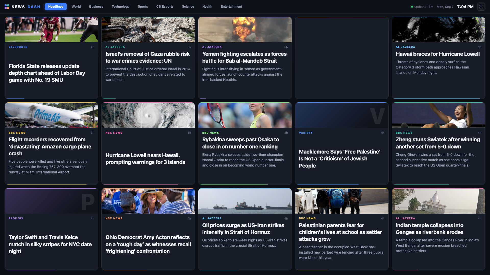

# News Dashboard

An ambient, fullscreen news dashboard built for a second monitor — now in
**React + TypeScript (Vite)**. Live headlines arrive as a grid of rich tiles
that continuously fade out and cycle to the next story, so you can glance over
the news without ever touching a scrollbar.



## Features

- **9 categories** — Headlines, World, Business, Technology, Sports,
  CS Esports, Science, Health, Entertainment — aggregated from BBC, NPR,
  Al Jazeera, The Verge, Ars Technica, TechCrunch, ESPN, Sky Sports, HLTV,
  Phys.org, ScienceDaily, STAT, Variety,
  MarketWatch, Yahoo Finance and Google News.
- **Rich tiles** — each card shows the article's photo (with a styled source
  monogram when a feed doesn't provide one), the headline and a short excerpt.
  Hover a tile to pause it and click to open the story.
- **Continuous tile cycling** — every tile swaps to the next headline every
  18 seconds on a staggered timer, with a thin progress bar on each card
  counting down to its next swap, so the whole board feels alive.
- **No API keys** — everything comes from public RSS feeds, fetched
  server-side (no CORS issues), deduped, and cached.
- **Keyboard shortcuts** — `F` toggles fullscreen, `Space` pauses/resumes all
  cycling, `1`–`9` switch categories.
- **Self-healing** — a dead feed never breaks a category; the grid adapts to
  any screen size or aspect ratio; connection status is shown in the header.

## Run it

**Option A — GitHub Pages (zero install):** the repo deploys itself to
**https://antonyperez0.github.io/news-dashboard/** — a GitHub Action rebuilds
the app and refetches all feeds every 15 minutes. Open it on your second
monitor, press `F` for fullscreen, and let it run.

**Option B — run locally (freshest data, 10-min server cache):**

```bash
npm install
npm run build        # typecheck + vite build → dist/
npm start            # → http://localhost:3000 (serves dist/ + live API)
```

**Developing:**

```bash
npm run dev          # vite dev server (proxies /api and /data to :3000)
npm run dev:server   # express API with hot reload
npm run build:data   # regenerate static news snapshots into dist/data
```

Both modes share the same UI: when the local Node API isn't reachable (Pages),
the frontend silently falls back to the static JSON snapshots in `dist/data/`.

## How it works

```
GitHub Action (every 15 min)                 local: npm start
       │ scripts/generate-data.js                   │ /api/news (10-min cache)
       ▼                                            ▼
dist/data/<category>.json  ──── both served to ────┐
                                                   ▼
                       browser polls every 5 min (API first, static fallback)
```

**Photo pipeline:** most RSS feeds ship no image, so each story falls back to
scraping its page's `og:image` — Google News gateway links are resolved back
to the real publisher URL first (via `google-news-url-decoder`). Coverage
lands around 85–91%; publishers that block scrapers (WSJ, Reuters…) show a
styled source monogram instead.

**React architecture:** tiles are driven by a single 250ms heartbeat that
checks each tile's `nextSwapAt` timestamp — content swaps, hover-pauses,
countdown bars and stuck-state healing are all pure functions of time, so a
throttled timer can never permanently freeze a tile (the bug that killed the
vanilla version).

- `server/server.js` — Express server, stale-while-revalidate cache, API
- `server/news.js` — RSS fetching/normalizing, og:image enrichment
- `server/feeds.js` — the category → feed registry (edit to add sources)
- `scripts/generate-data.js` — writes static news snapshots for Pages
- `.github/workflows/deploy.yml` — build + deploy to Pages every 15 min
- `src/` — the React dashboard (components, hooks, TypeScript types)

## Adding your own feeds

Add an entry to `server/feeds.js`:

```js
technology: {
  label: 'Technology',
  feeds: [
    { url: 'https://example.com/rss.xml', name: 'Example' },
    // aggregate: true strips the " - Outlet" suffix Google News appends
    { url: 'https://news.google.com/rss/…', name: 'Google News', aggregate: true }
  ]
}
```

Commit and push — the deploy action picks it up within 15 minutes.
